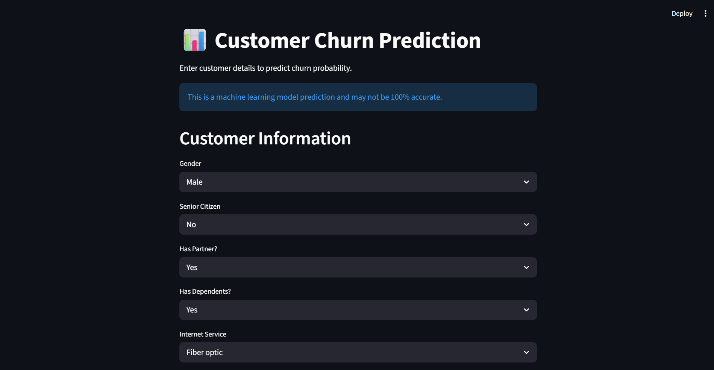
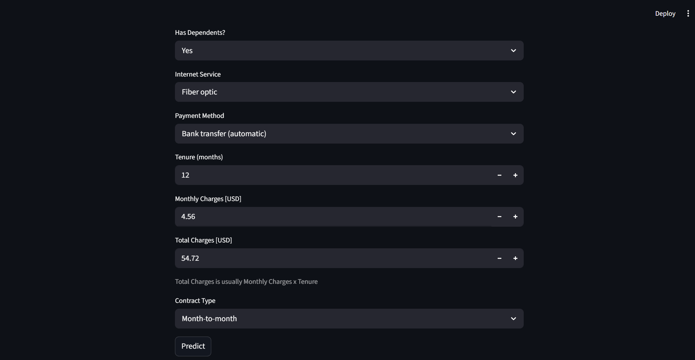
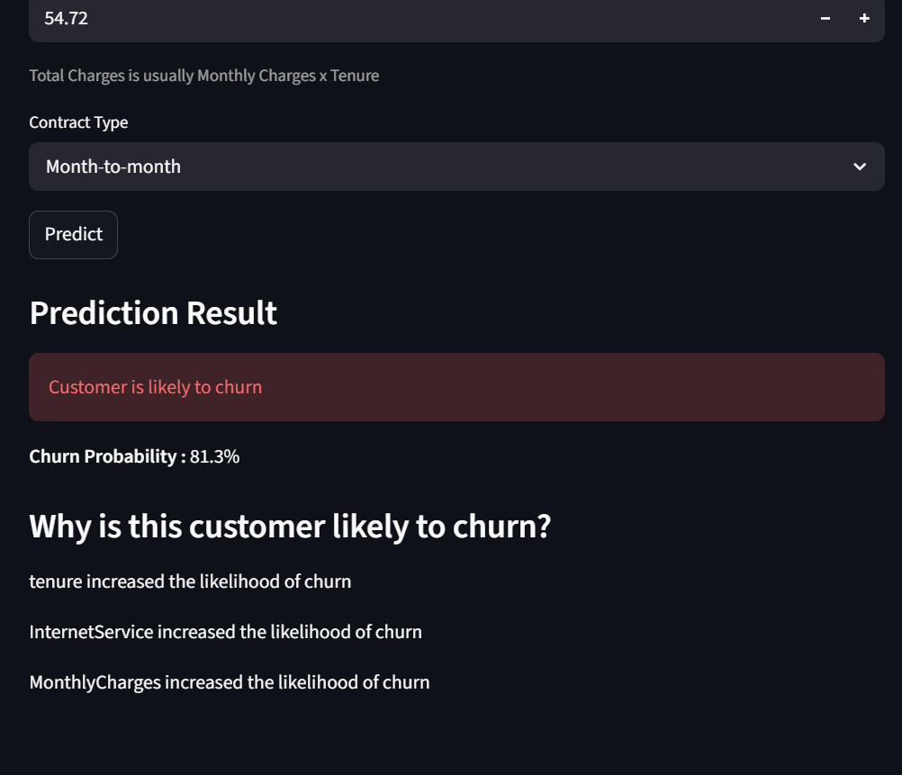
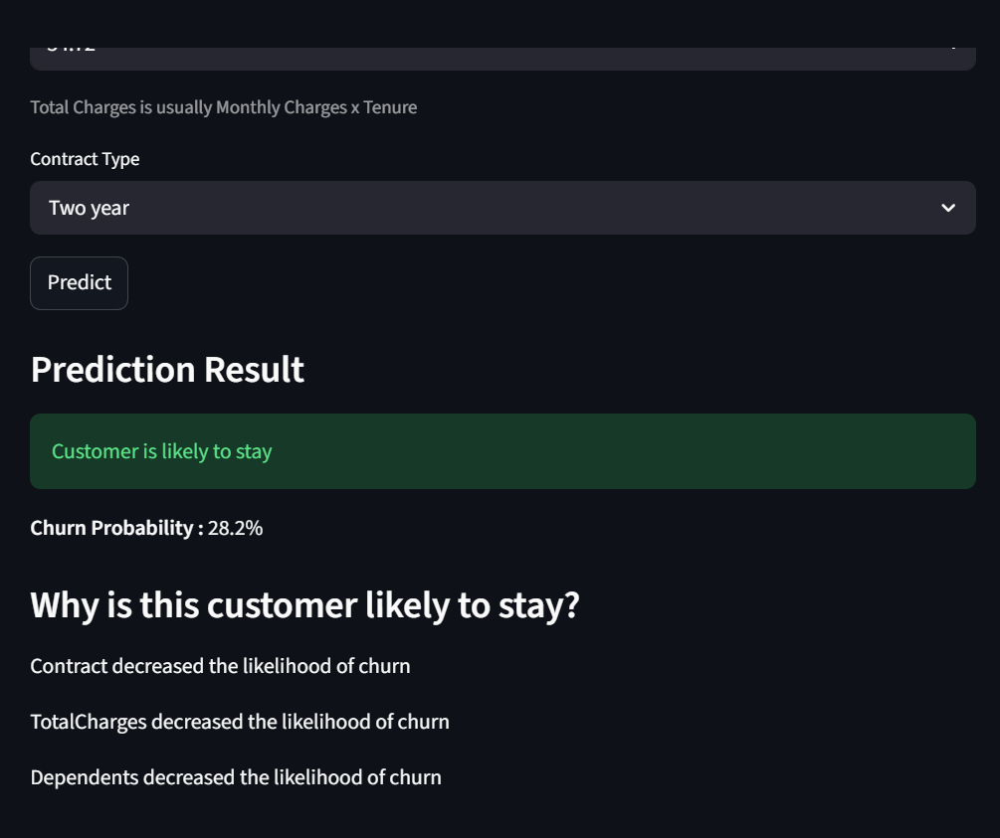
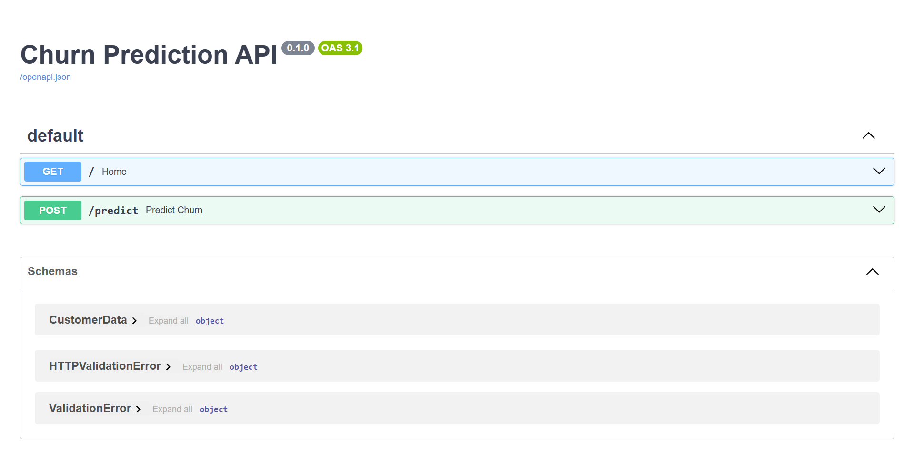

# Churn Prediction ML Project

This project implements a production-style end-to-end machine learning system to predict customer churn using real-world telecom data.

The system is designed with a modular architecture:
- A FastAPI backend serving the ML model as a REST API
- A Streamlit frontend for interactive user input and visualization

This separation ensures scalability, maintainability, and real-world applicability.

---

## 🌍 Live Demo

- 🔗 Frontend: https://churn-prediction-jitesh2511.streamlit.app  
- 🔗 API Docs: https://churn-api-1b90.onrender.com/docs

---

## 📸 Demo

### 🔹 Streamlit UI – Input Form



### 🔹 Streamlit UI – Prediction Result



### 🔹 FastAPI API Docs


---

## 🧠 System Architecture

Streamlit UI → FastAPI Backend → Prediction Pipeline → Trained Model → Response → UI

- **Streamlit** handles user interaction and visualization  
- **FastAPI** serves as the backend API for predictions  
- **Prediction Pipeline** processes input data and ensures consistency with training  
- **Model** generates churn predictions and probabilities  

---

## Tech Stack

* Python
* Pandas, NumPy
* scikit-learn
* Matplotlib, Seaborn
* FastAPI (Backend API)
* Streamlit (Frontend UI)

---

## Dataset

This project uses the **Telco Customer Churn dataset**, which contains customer-level information such as demographics, services used, and account details.

Dataset Link: https://www.kaggle.com/datasets/blastchar/telco-customer-churn

---

## Project Structure

```
churn-prediction/
│
├── app/                  # FastAPI backend
├── assets/               # Contains screenshots of Demo
├── src/                  # ML pipeline and preprocessing
├── notebooks/            # EDA and experimentation
├── model/                # Saved model artifacts
│
├── data/                 # Dataset (not tracked)
├── .venv/                # Virtual environment (not tracked)
│
├── app.py                 # Streamlit UI Frontend
├── requirements.txt       # Project dependencies
├── .gitignore
├── README.md
├── LICENSE
```
> Note: The `data/` and `.venv/` directories are excluded from version control via `.gitignore`.

---

## Getting Started

### 1. Clone the repository

```bash
git clone https://github.com/jitesh2511/Churn-Prediction
cd churn-prediction
```

### 2. Set up your environment

```bash
python -m venv .venv

# Activate the virtual environment:
# Windows:
.venv\Scripts\activate
# macOS/Linux:
source .venv/bin/activate

pip install -r requirements.txt
```

### 3. Prepare your data

- Download the dataset from the link above.
- Place the CSV file inside a `data/` directory in the project root

### 4. Train the model
This step generates the trained model and required artifacts for inference
```bash
python -m src.train
```

### 5. Run the backend (FastAPI)

```bash
uvicorn app.main:app --reload
```
API will be available at: http://127.0.0.1:8000/docs

### 6. Run the app

```bash
streamlit run app.py
```

---

## 🔍 Key Highlights

- End-to-end ML pipeline from EDA to deployment  
- High recall (90%) optimized for business use-case  
- Explainable predictions with feature-level insights  
- Modular architecture using FastAPI and Streamlit  
- Decoupled frontend and backend for scalability  

---

## Project Roadmap

- [x] Phase 1: Data Understanding  
  - Explored dataset structure, features, and initial insights  

- [x] Phase 2: Exploratory Data Analysis  
  - Identified key patterns and drivers of churn through visual analysis  

- [x] Phase 3: Data Preprocessing  
  - Cleaned data, encoded categorical features, and applied scaling  

- [x] Phase 4: Model Building  
  - Trained baseline Logistic Regression model and evaluated performance  

- [x] Phase 5: Model Improvement  
  - Optimized decision threshold and improved recall to 90%  

- [x] Phase 6: Prediction Pipeline  
  - Built reusable inference pipeline for processing unseen data  

- [x] Phase 7: Streamlit UI  
  - Developed interactive web app for real-time churn prediction  

- [x] Phase 8: Code Refactoring  
  - Modularized codebase and improved maintainability  

- [x] Phase 9: Explainability  
  - Added global and local interpretation of model predictions    

---

## 🚀 Future Improvements

- Improve system scalability and performance
- Experiment with advanced models such as Random Forest, XGBoost, and Gradient Boosting to improve performance  
- Add model monitoring and logging for tracking performance over time  
- Improve UI/UX for a more intuitive and polished user experience  

---

## ⚠️ Known Limitations

- Model trained on static dataset
- No real-time data updates
- Cold start delay due to free-tier deployment

---

## License

This project is licensed under the MIT License. See the [LICENSE](LICENSE) file for more details.

---
